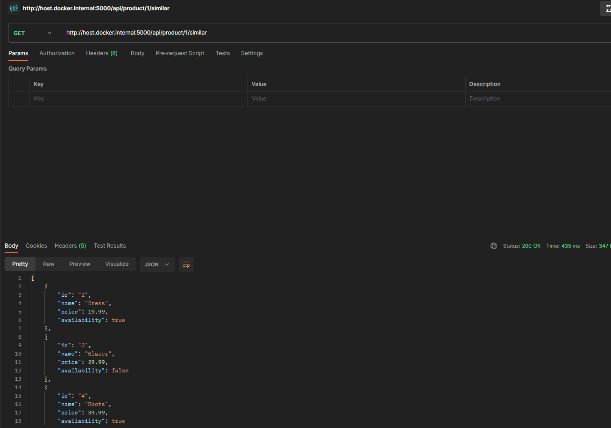

# Backend Dev Technical Test

This is a backend technical test project. Below are the instructions to run the project:

## Running with Docker

1. Make sure you have Docker installed on your machine. You can use Docker Desktop.

2. Open a terminal and navigate to the project's root folder.

3. Run the following command to start the services that the application will consume:
```
docker-compose up -d simulado influxdb grafana
```

4. Next, run the following command to build the Docker container image:
```
docker build -t backenddevtest:latest .
```

5. Finally, run the following command to launch the project:
```
docker run -p 5000:5000 backenddevtest:latest
```

## Running without Docker (Java 17)

1. Make sure you have Java 17 and Maven installed on your machine.

2. Open a terminal and navigate to the project's root folder.

3. Run the following command to compile the project:

```
mvn clean install
```

4. After successful compilation, run the following command to execute the project:
```
mvn spring-boot:run
```

5. Once the project has started successfully, you can access the Swagger URL in your browser.

## Swagger
Once the project has started successfully, you can access the Swagger URL in your browser:
```
http://localhost:5000/swagger-ui/index.html
```


## Making API Call with Postman

You can use Postman to make API calls to the running project. Here's an example of an API call you can make:

- **URL:** `http://localhost:5000/api/product/1/similar`
- **Method:** GET

You can also use this url: 
- **URL:** `http://host.docker.internal:5000/api/product/1/similar`

This API call retrieves similar products for the product with ID 1. You can customize the product ID as needed for your testing.

That's it! Now you can run your project both with and without Docker and make API calls using Postman.

Here is a Postman example:



## Running K6 Tests

To run K6 tests, you can use the following command:
```
docker-compose run --rm k6 run scripts/test.js
```

Make sure you have Docker installed and the project's services are running.